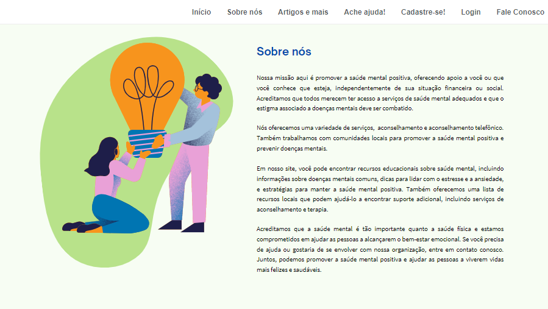
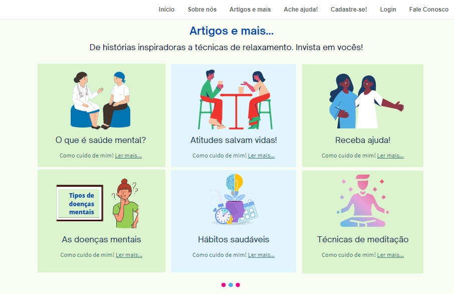
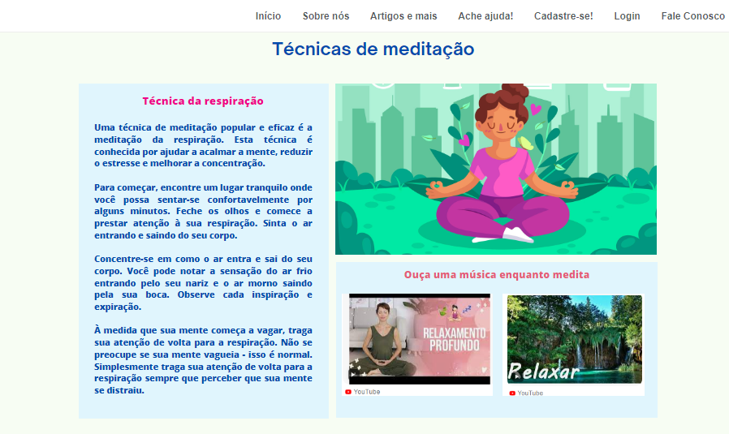

# Raízes da Cura

O **Raízes da Cura** é um projeto desenvolvido durante o curso promovido pela Proz Tecnologia. 
Trata-se de rede de apoio que conecta pessoas que precisam de ajuda psicológica à profissionais que desejam ajudá-las, 
bem como disponibiliza conteúdos esclarecedores e agregadores sobre o tema. 

## Componentes do grupo

* [aureliocapingana01](https://github.com/aureliocapingana01)
* [clarasousamath](https://github.com/clarasousamath)
* [Deisegoncalves](https://github.com/Deisegoncalves)
* [EfraimAdaias](https://github.com/EfraimAdaias)  
* [mirraelly](https://github.com/mirraelly)

## Objetivos

O objetivo do projeto é combater a escassez de materiais de apoio ao público em geral, 
que precise de ajuda psicológica ou que queira saber mais sobre o tema, e ainda ajudar ao próximo.
Dessa forma, ele faz a ponte entre quem precisa e a ajuda especializada. 

## Desenvolvimento

### Protótipo inicial 

Você pode conferir o protótipo inicial em [Raízes da Cura](https://mentesa.my.canva.site/)

### Telas

Apresentação da página inicial, com boas-vindas, logo, menu de navegação e carrossel de imagens.

Apresentação do intuito da página.

Carrosel de materiais contendo opções de leituras e práticas sobre o tema.

Exemplificação de uma das telas de leitura e prática. 

Oferece opções de locais de apoio e indicação de profissinais, com base na opção escolhida de estado brasileiro.

Contém formulário de cadastro no site para fazer parte da rede de apoio.

Contém opção de login com base no e-mail e senha do usuário.

Opções de contato com os autores do projeto e políticas de uso e privacidade.

## Agradecimentos

* Proz Tecnologia;
* Professor Luth;
* À cada membro do projeto pela dedicação;
* https://visualhunt.com/
* https://www.canva.com/